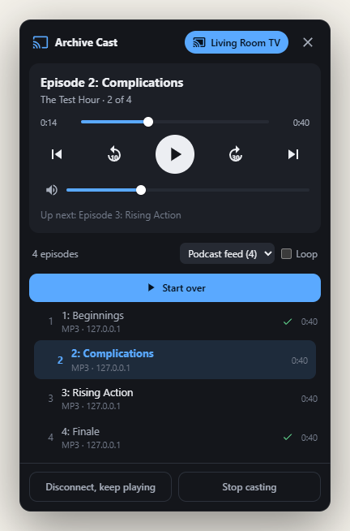
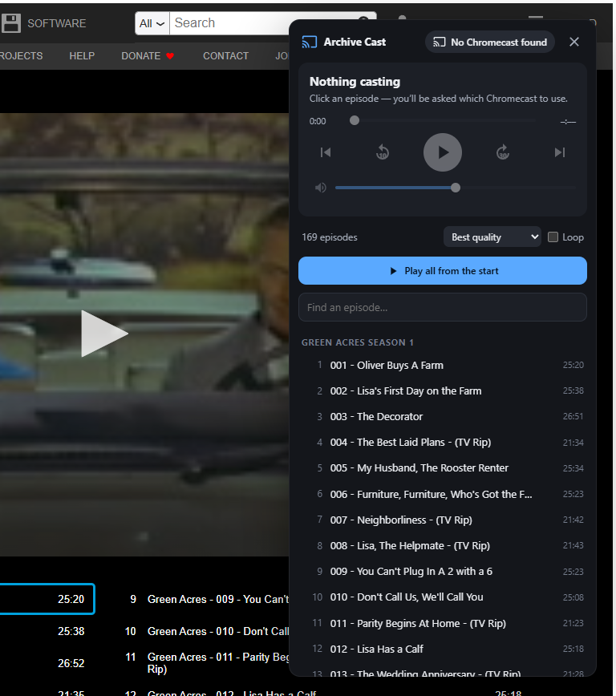

# Archive Cast

**Cast whole shows to your Chromecast, in order and with autoplay, without casting your screen.**

Archive Cast is a Chrome extension. It sends a show's episode files straight to your Chromecast as a queue. The TV fetches and plays them on its own, so your computer stays free and the next episode starts by itself. It works on the [Internet Archive](https://archive.org), on podcast sites, and on other sites with plain video or audio. It can also make a site's own Cast player continue to the next episode when it normally stops after one.

<p align="center"></p>

## What it does

- **archive.org shows, radio series and collections:** reads the item's file list and orders episodes naturally (S01E02 before S01E10, seasons grouped). It picks a file your Chromecast can play: the original MP4 when possible, otherwise archive.org's h.264/MP3 encodes. If an episode won't play, it switches to the compatible encode by itself.
- **Real autoplay:** the whole season goes to the Chromecast as one queue that plays itself. Close the tab or lock the computer and it keeps going.
- **Skip around:** previous/next, ±10/30 s, a seek bar, volume, jump to any episode, search the list, loop.
- **Remembers your place:** a Resume button and ✓ marks on episodes you've finished.
- **Other sites:** press the toolbar button on any page. Archive Cast offers what it can find:
  - **Podcast feed:** the site's RSS feed, played oldest first.
  - **On this page:** `<video>`/`<audio>` players and links to media files.
  - **Detected streams:** MP4, MP3, HLS and DASH that Chrome actually loads, which catches script-built players. The toolbar badge counts them.
  - **Find next episodes:** follows "Next episode" links to queue the following pages.
  - **Auto-advance:** for sites with their own Cast button that stop after each episode. When the episode ends, Archive Cast opens the next episode page and presses play on the site's player.
- **Scriptable by AI agents:** the same commands are available as an in-page JS API (`window.ArchiveCast`), an accessible panel with stable `data-ac-action` hooks, an **MCP server** for Claude Code/Desktop, Cursor and other clients, and messaging from other extensions. See [AGENTS.md](AGENTS.md).

<details>
<summary>On archive.org</summary>
<p></p>
</details>

## Install

Archive Cast isn't in the Chrome Web Store, so you load it as an unpacked extension (about a minute):

1. Download this repo: **Code → Download ZIP** and unzip it, or `git clone https://github.com/Arthurman70/archive-cast`.
2. Open `chrome://extensions` and turn on **Developer mode** (top right).
3. Click **Load unpacked** and choose the `archive-cast` folder (the one with `manifest.json`).
4. Optional: pin **Archive Cast** from the puzzle-piece menu.

It works in Chrome 120+ on Windows, macOS, Linux and ChromeOS. Chromecast support is built into Chrome, so you only need a Chromecast or Google TV on the same network. To update, pull or re-download, then press the reload icon on the extension's card.

## Use it

**archive.org:** open a show, e.g. [Get Smart](https://archive.org/details/get-smart), [Green Acres](https://archive.org/details/GreenAcresCompleteSeries) or the [Gunsmoke radio show](https://archive.org/details/OTRR_Gunsmoke_Singles). Click the round cast button at the bottom right, then click an episode. Chrome asks which Chromecast to use, and that episode plus everything after it goes to the TV.

**Other sites:** press the Archive Cast toolbar button on the page. The site is remembered, so the cast button shows up there by itself next time. Use the list menu to switch between *Podcast feed*, *On this page*, *Detected streams* and *Next pages*.

- **Nothing listed?** Start the site's player for a moment so Chrome loads the video, then press **Rescan**.
- **The site already has a Cast button that stops after every episode?** Cast with the site's button as usual and tick **Auto-advance** in the panel. Keep that tab open.
- **"This site's security policy blocks Google Cast"?** Click **Allow**. Archive Cast relaxes the policy for that one tab only, until it closes, and reloads the page.

The panel's controls work from any page of the site. **Disconnect, keep playing** leaves the Chromecast running, and the toolbar button takes you back to the show later.

### What can't be cast

- DRM-protected services (Netflix, Disney+, …), and sites whose Chromecast app only accepts their own content IDs.
- HLS/DASH streams on servers that don't send CORS headers: the Chromecast refuses them. Plain MP4/MP3 always works.
- Links that expire within minutes, or that need your cookies or a specific referrer.

## Control it with AI

Everything in the panel is also a command. Full reference: **[AGENTS.md](AGENTS.md)**.

**In the page** (Claude in Chrome, Playwright, the DevTools console):

```js
await ArchiveCast.listEpisodes({ query: 'S02' });
await ArchiveCast.play(14);             // queue episode 15 and everything after it
await ArchiveCast.seekBy(-30);
```

**MCP** (Claude Code, Claude Desktop, Cursor, …). It needs Node 22+ and has no dependencies:

```bash
claude mcp add archive-cast -- node /path/to/archive-cast/mcp/server.mjs
```

Or add it to your client's config:

```json
{ "mcpServers": { "archive-cast": { "command": "node", "args": ["/path/to/archive-cast/mcp/server.mjs"] } } }
```

Then open Archive Cast's options (right-click the toolbar icon → **Options**) and turn on **Connect to the local MCP server**. You can now say things like *"put on Get Smart season 2 on the TV"* or *"skip back 30 seconds"*. For shell-only agents, the same file works as a CLI: `node mcp/server.mjs call play_episode '{"index":0}'`.

**Other extensions:** turn on *Allow other extensions* in options, then `chrome.runtime.sendMessage(ARCHIVE_CAST_ID, {cmd: 'play', args: {index: 0}})`.

One step stays human: Chrome only opens its Chromecast picker after a real click. Someone presses **Connect** once, and after that agents can do everything else.

## Privacy and permissions

Archive Cast has no servers, analytics or accounts. Media goes from the website straight to your Chromecast.

| Permission | Why |
|---|---|
| Read and change data on all websites | Show the panel on the sites you choose, read their feeds and next-episode pages, and notice media files Chrome loads (the badge count). Detected URLs stay in memory for that tab and are cleared when it navigates or closes. |
| `webRequest` | The stream detector: it reads response headers only and never blocks or changes anything. |
| `declarativeNetRequestWithHostAccess` | Only when you click **Allow** on a site that blocks Google Cast: removes that page's Content-Security-Policy header for that one tab, until it closes. |
| `scripting`, `storage`, `alarms` | Show the panel; remember settings, progress and sites; reconnect to the MCP server if you enabled it. |

Your progress, watched marks and settings live in `chrome.storage` in your browser. MCP and other-extension control are off until you turn them on. The MCP bridge only listens on `127.0.0.1` and refuses connections from web pages.

## How it works

- **The Cast SDK runs in the page.** It's injected with the page's own CSP nonce, so sites like archive.org that only allow nonce'd scripts still load it. Sites that ship their own Cast player get *shared mode*: Archive Cast leaves their Cast setup alone and runs its own session alongside, or reuses theirs.
- **The Chromecast does the autoplay.** Episodes are sent to Google's Default Media Receiver as one queue in batches under Cast's 64 KB message limit, so autoplay doesn't depend on the browser. Auto-advance for a site's own player is the exception: that runs in the tab.

```
lib/episodes.js   archive.org metadata → ordered, castable episodes
lib/generic.js    any page: media elements, links, JSON-LD/OpenGraph, feeds, next links, network responses
lib/commands.js   the command catalog shared by the JS API, extension messaging and MCP
castbridge.js     page world: Google Cast SDK, sessions, the receiver queue, window.ArchiveCast
content.js        the panel, site adapters, progress, and the command dispatcher
background.js     toolbar button, injection, stream detector, routing, MCP bridge client
mcp/server.mjs    MCP server (stdio) + local WebSocket hub + CLI
```

## Development

```bash
npm test                            # unit tests: episode ordering on real archive.org metadata, stream rules, MCP server
cd test/e2e && npm install && npm test
```

The end-to-end suite loads the extension into a throwaway Chrome profile with Puppeteer. It drives a local test site that uses a fake Cast SDK, so queues, skipping, autoplay, the stream detector, next-page following, site-player auto-advance and the MCP bridge are all exercised without a TV. It also checks live archive.org. Set `CHROME=/path/to/chrome` if Chrome isn't in the usual place, or `HEADFUL=1` to watch it run.

When you edit the extension, reload it from `chrome://extensions`, or call the `reload_extension` tool if the MCP bridge is on.

## License

[MIT](LICENSE)
